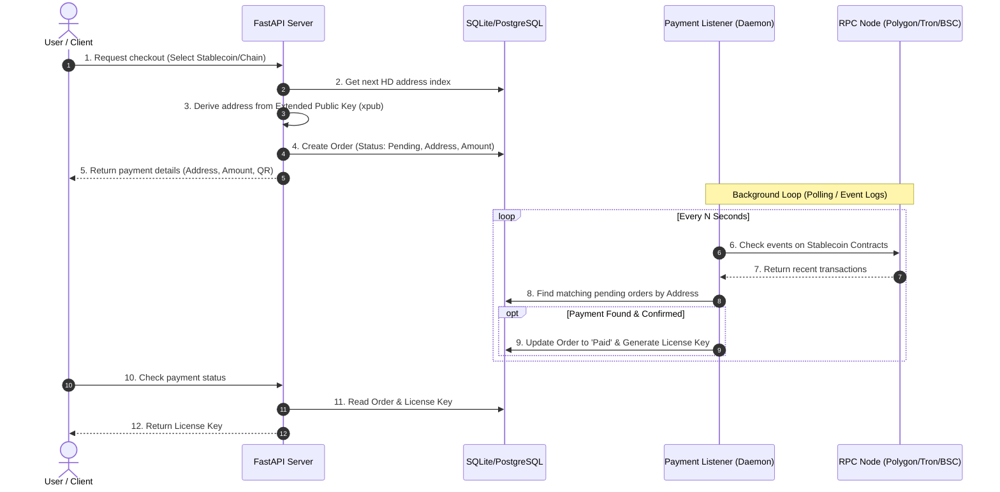
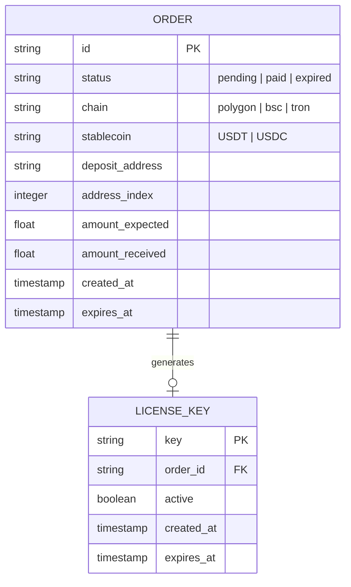

# Self-Hosted Privacy-Conscious Crypto Payment Gateway

This document outlines the architecture, tool recommendations, database schema, and step-by-step implementation plan for integrating a self-hosted, multi-chain stablecoin payment gateway with a Python backend (specifically for the Coursera Traverser Engine).

---

## 1. Architectural Overview

To achieve **global access**, **privacy (no KYC)**, and **automated verification**, the payment gateway operates on a self-hosted backend using Hierarchical Deterministic (HD) wallets. This avoids storing private keys on a public-facing web server and enables the dynamic generation of unique deposit addresses for every transaction.

### High-Level Architecture



### Key Architectural Decisions & Trade-offs

#### A. Address Assignment: HD Wallet (xpub) vs. Single-Address + Tx Hash
1. **HD Wallet (xpub) - *Recommended***:
   - **How it works:** You import a master public key (xpub/ypub/zpub) into the backend. For each checkout, the backend derives a new address index (e.g., `m/44'/60'/0'/0/i`).
   - **Pros:** Unique address per user. Extremely simple matching logic (funds sent to Address $X$ belong to Order $Y$). High user privacy (addresses are not linked to each other on-chain easily).
   - **Cons:** Sweeping funds from derived addresses requires gas on each address, which can consume significant fees on Ethereum mainnet (but is negligible on Polygon/BSC).
2. **Single Address with Tx Hash / Unique Amounts**:
   - **How it works:** All users send funds to the same address. To identify their payment, they either submit the transaction hash (TxID) in the UI, or the system generates a unique payment amount (e.g., $10.001, $10.002) and monitors for that specific incoming amount.
   - **Pros:** Zero gas overhead for sweeping (all funds land directly in your main wallet).
   - **Cons:** Vulnerable to user input mistakes (entering wrong TxID). Harder to automate if multiple users pay identical amounts simultaneously. Reduced privacy (all customer payments are visible on a single address).

> [!TIP]
> **Recommendation:** Use **HD Wallet Address Derivation** on low-fee chains (Polygon, BSC, Tron). The gas fee to sweep from a derived EVM address on Polygon or BSC is typically less than $0.01, making address-per-order derivation viable and highly secure.

---

## 2. Recommended Technology Stack & Open-Source Tools

For a fully self-hosted, private solution, we avoid centralized APIs like Coinbase Commerce or Shopify Gateway.

### A. Core Python Blockchain Libraries
* **EVM Chains (Polygon, Binance Smart Chain):** [web3.py](https://github.com/ethereum/web3.py)
  - The standard library for interacting with Ethereum-compatible blockchains. Used to query ERC-20 contract balances and event logs.
* **Tron Chain (TRC-20 USDT):** [tronpy](https://github.com/andelf/tronpy)
  - A robust Python library for the Tron network, essential for monitoring TRC-20 USDT transfers.
* **Key Derivation (HD Wallets):** [bip-utils](https://github.com/ebellocchia/bip_utils)
  - Python package for BIP-39 (mnemonic), BIP-44, BIP-49, and BIP-84 HD wallet derivation. It allows generating EVM and Tron addresses from an xpub.

### B. Node Infrastructure (RPC Providers)
Running a full node requires massive hardware. Instead, we can use **privacy-preserving public RPC endpoints** or free-tier developer RPC endpoints:
* **EVM Public Nodes:** [Chainlist](https://chainlist.org/) provides a list of free public RPC URLs for Polygon and BSC.
* **Commercial Free-Tiers (No KYC):** Services like [Ankr](https://www.ankr.com/), [QuickNode](https://www.quicknode.com/), or [DRPC](https://drpc.org/) offer free-tier API endpoints with high rate limits, requiring only an anonymous email to register.
* **Tron Grid:** [Trongrid](https://www.trongrid.io/) offers a free tier for querying Tron contract logs.

---

## 3. Database Schema

A relational database (SQLite for local testing/simplicity, PostgreSQL for production) will track orders, addresses, and license keys.



### SQL Schema Definition (SQLAlchemy Example)

```python
from sqlalchemy import Column, String, Integer, Float, Boolean, DateTime, ForeignKey
from sqlalchemy.orm import declarative_base, relationship
import datetime

Base = declarative_base()

class Order(Base):
    __tablename__ = "orders"

    id = Column(String, primary_key=True)
    status = Column(String, default="pending")  # pending, paid, expired, swept
    chain = Column(String, nullable=False)      # e.g., "polygon", "bsc", "tron"
    stablecoin = Column(String, nullable=False) # e.g., "USDT", "USDC"
    deposit_address = Column(String, unique=True, index=True, nullable=False)
    address_index = Column(Integer, unique=True, nullable=False)
    amount_expected = Column(Float, nullable=False)
    amount_received = Column(Float, default=0.0)
    created_at = Column(DateTime, default=datetime.datetime.utcnow)
    expires_at = Column(DateTime, nullable=False)

    license_key = relationship("LicenseKey", back_populates="order", uselist=False)

class LicenseKey(Base):
    __tablename__ = "license_keys"

    key = Column(String, primary_key=True)
    order_id = Column(String, ForeignKey("orders.id"), unique=True, nullable=False)
    active = Column(Boolean, default=True)
    created_at = Column(DateTime, default=datetime.datetime.utcnow)
    expires_at = Column(DateTime, nullable=True) # None for lifetime access

    order = relationship("Order", back_populates="license_key")
```

---

## 4. Step-by-Step Implementation Plan

### Step 1: Secure Key Generation (Off-chain)
1. Generate a secure 12 or 24-word seed phrase offline (e.g., using a hardware wallet or an air-gapped machine).
2. Derive the **Extended Public Key (xpub)** for your target chains.
   - For EVM (Ethereum/Polygon/BSC derivation path: `m/44'/60'/0'`): Obtain the `xpub`.
   - For Tron (derivation path: `m/44'/195'/0'`): Obtain the `xpub`.
3. Save **only** the `xpub` in your web server's environment configuration. **Never upload the seed phrase or private keys to the web server.**

### Step 2: Write Address Derivation Logic in Python
Use `bip-utils` to dynamically derive public addresses for users.

```python
from bip_utils import Bip44, Bip44Coins, Bip44Changes

def derive_evm_address(xpub_str: str, index: int) -> str:
    """Derives an Ethereum/Polygon/BSC address from an xpub at a given index."""
    bip44_mst = Bip44.FromExtendedKey(xpub_str, Bip44Coins.ETHEREUM)
    bip44_addr = bip44_mst.Purpose().Coin().Account(0).Change(Bip44Changes.EXTERNAL).AddressIndex(index)
    return bip44_addr.PublicKey().ToAddress()

def derive_tron_address(xpub_str: str, index: int) -> str:
    """Derives a Tron address from an xpub at a given index."""
    bip44_mst = Bip44.FromExtendedKey(xpub_str, Bip44Coins.TRON)
    bip44_addr = bip44_mst.Purpose().Coin().Account(0).Change(Bip44Changes.EXTERNAL).AddressIndex(index)
    return bip44_addr.PublicKey().ToAddress()
```

### Step 3: Set Up Payment Monitoring (The Listener Loop)
The listener daemon is a background process running alongside the web API. It regularly polls for new transactions on the blockchain.

Instead of scanning all transactions, you query the specific stablecoin smart contract for **Transfer** events to any of your pending deposit addresses.

#### ERC-20 Transfer Event ABI (Minimal)
```json
[
  {
    "anonymous": false,
    "inputs": [
      {"indexed": true, "name": "from", "type": "address"},
      {"indexed": true, "name": "to", "type": "address"},
      {"value": false, "name": "value", "type": "uint256"}
    ],
    "name": "Transfer",
    "type": "event"
  }
]
```

#### Monitoring Script Structure (EVM Chains)
```python
import asyncio
from web3 import Web3

# Polygon USDT contract address
USDT_CONTRACT_POLYGON = "0xc2132D05D31c914a87C6611C10748AEb04B58e8F"
# Minimal ABI to capture Transfer events
MINIMAL_ABI = [...] 

async def monitor_payments():
    # Connect to Polygon RPC Node
    w3 = Web3(Web3.HTTPProvider("https://polygon-rpc.com"))
    contract = w3.eth.contract(address=USDT_CONTRACT_POLYGON, abi=MINIMAL_ABI)
    
    # We poll recent blocks for Transfer events
    last_processed_block = w3.eth.block_number - 100
    
    while True:
        try:
            current_block = w3.eth.block_number
            if current_block > last_processed_block:
                # Fetch Transfer events from last processed block to current block
                events = contract.events.Transfer.get_logs(
                    from_block=last_processed_block + 1,
                    to_block=current_block
                )
                
                for event in events:
                    to_address = event['args']['to']
                    value = event['args']['value']
                    # Divide by token decimals (USDT has 6 decimals on Polygon/Tron)
                    amount = value / 1e6 
                    
                    # 1. Check if 'to_address' is in our database under 'pending' orders
                    order = get_pending_order_by_address(to_address)
                    if order and amount >= order.amount_expected:
                        # 2. Verify tx confirmations
                        # Wait for e.g. 10 blocks (on Polygon, ~25 seconds) to prevent reorgs
                        tx_receipt = w3.eth.get_transaction_receipt(event['transactionHash'])
                        confirmations = current_block - tx_receipt['blockNumber']
                        
                        if confirmations >= 10:
                            # 3. Complete payment & issue license key
                            mark_order_paid(order.id, amount, event['transactionHash'].hex())
                
                last_processed_block = current_block
        except Exception as e:
            print(f"Error during listener execution: {e}")
            
        await asyncio.sleep(15)  # Poll every 15 seconds
```

### Step 4: License Key Generation & Database Operations
Once the backend confirms the payment:
1. Generate a cryptographically secure random string (e.g., using `secrets.token_urlsafe(32)`).
2. Insert a record into the `license_keys` table with an expiration date (if applicable).
3. Update the order status to `paid`.
4. (Optional) Send a webhook or trigger an event in the Coursera Traverser Engine to authorize access.

### Step 5: Gas & Sweeping Management
Because payments land on derived sub-addresses:
* **The Problem:** The tokens are trapped on individual sub-addresses.
* **The Solution:** To sweep them to your master cold wallet, you must execute a transfer from each sub-address. For EVM chains, this transaction requires gas (e.g., POL on Polygon or BNB on BSC) to be present on the sub-address.
* **Automated Sweeping Process:**
  1. Transfer a tiny amount of gas token (e.g., $0.05 worth of POL) from a centralized sweeping gas wallet to the sub-address.
  2. Wait for gas confirmation.
  3. Submit a transaction from the sub-address calling `transfer(master_cold_wallet_address, balance)` on the stablecoin contract.
  4. Alternatively, use a **Forwarder Smart Contract** architecture: Customers pay a central contract factory, which routes payments and emits events with custom `order_id` values, avoiding individual address gas issues entirely. (Recommended as a phase-2 optimization).

---

## 5. Security & Privacy Best Practices

1. **Server Isolation:** Keep the database containing derived addresses and order records isolated from standard logs. Don't log IP addresses or personal customer data alongside transactions.
2. **Cold Wallet Storage:** Make sure the master wallet derived from the seed phrase is never stored or used on any web-connected server. Keep it in cold storage (hardware wallet or paper seed).
3. **RPC Reliability & Redundancy:** Public RPC nodes can occasionally fail or experience rate-limiting. Implement a fallback list of RPC providers in your Python client:
   ```python
   providers = [
       "https://polygon-rpc.com",
       "https://rpc.ankr.com/polygon",
       "https://polygon.llamarpc.com"
   ]
   ```
4. **Timeouts:** Automatically mark orders as `expired` if payment is not detected within 1-2 hours to release the derived address back to a pool or stop monitoring it, preventing bloated database check loops.
